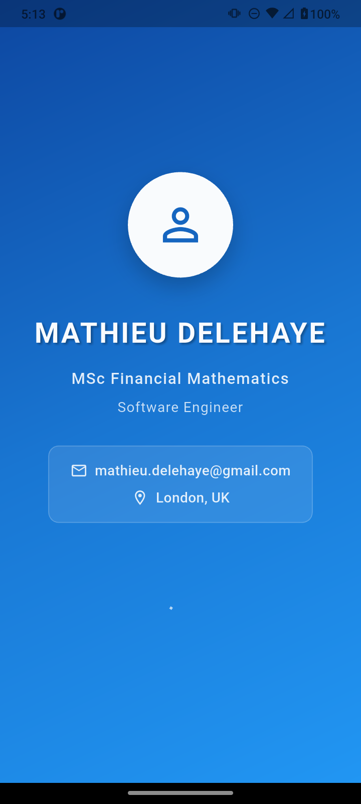
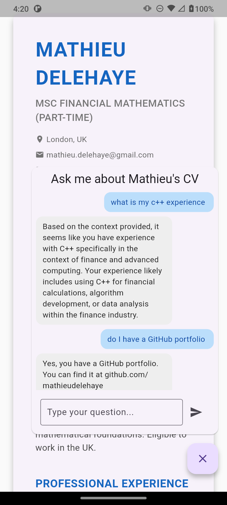

# Mathieu Delehaye - Interactive AI-Powered CV

A modern, responsive CV built with Flutter that works on web, mobile, and desktop platforms, featuring an AI-powered chatbot for interactive Q&A about professional experience.

## 🌐 Live Application

**🚀 [View Live CV Application](https://cv-flutter-app.onrender.com/)**

> **⏳ Note:** The first question to the chatbot may take a couple of seconds to respond as the system initializes. Subsequent questions will be much faster.

## 📸 Screenshots

### Desktop & Web View


### Mobile Views
<div style="display: flex; gap: 20px;">
  
  
</div>

## 🚀 Features

- **🌐 Cross-Platform**: Single codebase for web, Android, iOS, and desktop
- **📱 Responsive Design**: Works seamlessly on desktop, tablet, and mobile
- **🎨 Modern UI**: Clean, professional layout with Material Design
- **🔍 SEO Optimized**: Enhanced search engine indexing with static content and comprehensive meta tags
- **🤖 AI-Powered Chat**: Interactive Q&A about Mathieu's experience using OpenAI GPT
- **🧠 RAG Architecture**: Retrieval Augmented Generation with vector embeddings for accurate CV-specific responses
- **📊 Vector Search**: PostgreSQL with pgvector extension for semantic similarity search
- **⚡ Real-time Responses**: Instant answers to questions about skills, experience, and projects
- **🔒 Privacy-First**: No user data storage, temporary processing only
- **☁️ Cloud Deployed**: Hosted on Azure Container Apps with automatic scaling

## 🏆 Project Achievements

### ✅ Completed Features

1. **📋 CV UI Layout** - Professional Flutter CV with sections for experience, education, and skills
2. **🤖 AI Backend** - Python FastAPI backend with OpenAI integration for intelligent CV Q&A
3. **🔗 AI Flutter Integration** - Seamless AI chat widget integrated into Flutter app with API calls
4. **🌐 Web SEO Optimization** - Flutter web configured with enhanced SEO including static landing page and comprehensive meta tags
5. **☁️ Azure Deployment** - Both backend and frontend deployed to Azure Container Apps with custom domains
6. **🔒 Privacy Compliance** - Removed all data collection/logging to eliminate privacy compliance requirements
7. **📚 Advanced Chatbot** - LangChain-powered chatbot with OpenAI and vector storage for intelligent responses
8. **📖 Documentation** - Complete README with privacy notices and deployment instructions

### 🔄 In Progress

- **📱 Android Build** - Building and testing Android APK for Google Play Store submission

## 🔒 Privacy Notice & Data Handling

This application prioritizes your privacy and includes transparent data handling practices:

### 🤖 AI Chat Feature
- **Real-time Processing**: Your chat messages are sent to OpenAI's API for intelligent responses about Mathieu's CV
- **No Storage**: Chat messages and conversations are **never stored** or logged anywhere
- **Temporary Processing**: Messages exist only during the request/response cycle
- **No Personal Data Collection**: We do not collect, store, or track any personal identifying information
- **Session-based**: Each conversation is independent with no history retention

### 📊 Database Usage
- **READ-ONLY Access**: The application connects to a database in READ-ONLY mode
- **CV Content Only**: Database contains exclusively Mathieu's CV content and AI embeddings
- **No User Data**: Zero user data, chat logs, or personal information stored in the database
- **Fallback Support**: Application works with in-memory storage if database is unavailable

### 🔐 Data Flow
1. You type a question in the chat
2. Question is sent to OpenAI's API for processing
3. AI generates a response based on CV content
4. Response is displayed to you
5. **Nothing is stored** - the conversation ends there

### 📋 Third-Party Services
- **OpenAI API**: Chat messages are processed by OpenAI's GPT model
- **Review OpenAI's Privacy Policy**: [OpenAI Privacy Policy](https://openai.com/privacy/)
- **Azure Hosting**: Application hosted on Microsoft Azure (no user data stored)

**By using the chat feature, you acknowledge that your messages will be temporarily sent to OpenAI's servers for processing. No conversation history is retained by this application.**

## 🛠️ Tech Stack

### Frontend
- **Flutter**: Cross-platform UI framework
- **Dart**: Programming language
- **Material Design**: Google's design system
- **Skwasm + CanvasKit**: Modern web rendering with CanvasKit fallback

### Backend
- **FastAPI**: High-performance Python web framework
- **LangChain**: AI framework for intelligent responses
- **OpenAI API**: GPT-powered chat responses
- **ChromaDB**: Vector database for semantic search
- **PostgreSQL**: READ-ONLY database for CV embeddings

### Infrastructure
- **Azure Container Apps**: Cloud hosting with auto-scaling
- **Docker**: Containerized deployment
- **GitHub Actions**: CI/CD pipeline
- **Custom Domains**: Professional URL setup

## 🧠 RAG Architecture

The chatbot uses **Retrieval Augmented Generation (RAG)** to provide accurate, context-aware responses about Mathieu's professional background:

### How RAG Works in This App

1. **Vector Embeddings**: CV content is converted to high-dimensional vectors using OpenAI's embedding model
2. **Vector Storage**: Embeddings are stored in PostgreSQL with pgvector extension for efficient similarity search
3. **Semantic Retrieval**: When you ask a question, the system:
   - Converts your question to a vector embedding
   - Searches for the most similar CV sections using cosine similarity
   - Retrieves the top 4 most relevant pieces of content
4. **Contextual Generation**: LangChain combines retrieved CV sections with your question and sends to OpenAI GPT
5. **Source Attribution**: Responses include citations of which CV sections were used

### Technical Implementation
- **Production**: PostgreSQL with pgvector for persistent vector storage
- **Fallback**: ChromaDB in-memory storage if database unavailable
- **Chunking**: CV content split into 500-character chunks with 50-character overlap
- **Memory**: Conversation buffer maintains context across questions
- **Search**: Cosine similarity with configurable top-k retrieval (default: 4)

This architecture ensures responses are grounded in actual CV content rather than general knowledge, providing accurate and verifiable information about Mathieu's professional experience.

## 📋 Prerequisites

Before running this project, make sure you have:

1. **Flutter SDK** installed ([Installation Guide](https://docs.flutter.dev/get-started/install))
2. **Python 3.8+** for backend development
3. **Docker** for containerized deployment
4. **OpenAI API Key** for AI functionality
5. **A code editor** (VS Code, Android Studio, or IntelliJ)

## 🏃‍♂️ How to Run

### Frontend (Flutter)

#### 1. Clone the Repository
```bash
git clone <your-repository-url>
cd cv_flutter_app
```

#### 2. Install Dependencies
```bash
flutter pub get
```

#### 3. Run on Different Platforms

**Web (Browser)**
```bash
flutter run -d chrome
```

**Mobile (with emulator/device connected)**
```bash
flutter run
```

**Desktop**
```bash
flutter run -d windows  # or macos, linux
```

### Backend (FastAPI)

#### 1. Navigate to Backend Directory
```bash
cd chatbot_backend
```

#### 2. Create Virtual Environment
```bash
python -m venv .venv
source .venv/bin/activate  # On Windows: .venv\Scripts\activate
```

#### 3. Install Dependencies
```bash
pip install -r requirements.txt
```

#### 4. Set Environment Variables
```bash
# Create .env file
echo "OPENAI_API_KEY=your_openai_api_key_here" > .env
```

#### 5. Run Backend Server
```bash
uvicorn main:app --reload
```

## 🌐 Building for Production

### Frontend Build
```bash
flutter build web --release --wasm
```

### Backend Docker Build
```bash
docker build -t mathieu-cv-backend .
```

## ☁️ Azure Deployment

The application is deployed using Azure Container Apps with the following architecture:

- **Frontend**: Flutter web app with custom domain
- **Backend**: FastAPI server with OpenAI integration
- **Database**: PostgreSQL for CV embeddings (READ-ONLY)
- **Auto-scaling**: Handles traffic spikes automatically
- **HTTPS**: Secure connections with SSL certificates

### Deployment Commands
```bash
# Deploy backend
az containerapp create \
  --name mathieu-cv-backend \
  --resource-group your-resource-group \
  --image mathieu-cv-backend \
  --environment-variables OPENAI_API_KEY=secretref:openai-key

# Deploy frontend
az containerapp create \
  --name mathieu-cv-frontend \
  --resource-group your-resource-group \
  --image mathieu-cv-frontend \
  --ingress external \
  --target-port 80
```

## 🔍 SEO Configuration

The project includes comprehensive SEO optimizations:

- **Meta tags** in `web/index.html`
- **Sitemap** at `web/sitemap.xml`
- **Static landing page** with duplicate content for improved search engine indexing
- **Open Graph** tags for social sharing
- **Structured data** for rich snippets
- **Performance optimization** for Core Web Vitals
- **Additional SEO improvements** currently under test and investigation

## 📁 Project Structure

```
MDelehayeAIResume/
├── cv_flutter_app/           # Flutter frontend
│   ├── lib/
│   │   └── main.dart         # Main application code
│   ├── web/
│   │   ├── index.html        # SEO-optimized HTML
│   │   └── sitemap.xml       # Search engine sitemap
│   └── pubspec.yaml          # Flutter dependencies
├── chatbot_backend/          # FastAPI backend
│   ├── main.py              # Backend API server
│   ├── requirements.txt     # Python dependencies
│   └── Dockerfile           # Container configuration
├── Screenshots/             # Application screenshots
└── README.md               # This file
```

## 🎨 Customization

### Frontend Styling
- Colors and themes are defined in `lib/main.dart`
- Modify the `ThemeData` in the `CVApp` class
- Change colors in the `Colors.blue` references

### Backend Configuration
- Update CV content in the vector database
- Modify AI prompts in `main.py`
- Configure OpenAI model parameters

### Content Updates
- Update personal information in the `_buildHeader()` method
- Modify experience in the `_buildExperience()` method
- Add projects in the `_buildProjects()` method

## 🚀 Performance

- **Fast Loading**: Optimized Flutter web build with Skwasm rendering
- **Responsive**: Smooth performance on all devices
- **SEO Friendly**: Enhanced search engine indexing with static content
- **Scalable**: Auto-scaling backend infrastructure
- **Reliable**: Fallback mechanisms for offline functionality

## 📝 License

This project is open source and available under the [MIT License](LICENSE).

## 📧 Contact

**Mathieu Delehaye**
- 🌐 **Live CV**: [View Interactive CV](https://cv-flutter-app.onrender.com/)
- 📧 **Email**: mathieu.delehaye@gmail.com
- 💼 **LinkedIn**: [linkedin.com/in/mathieudelehaye](https://linkedin.com/in/mathieudelehaye)
- 🐙 **GitHub**: [github.com/mathieudelehaye](https://github.com/mathieudelehaye)

---

*Built with ❤️ using Flutter, FastAPI, and OpenAI • Deployed on Azure Container Apps*
